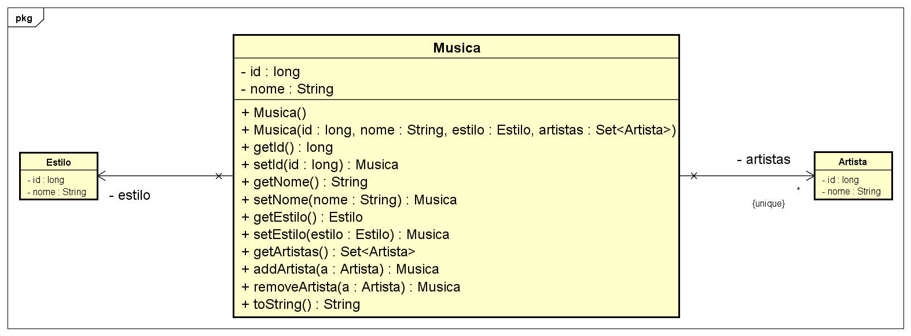

# Benezinho em alto e bom som 🤓👍🏾

SIMULADO - Domain Driven Design aplicada em 24/08/2023.

|                | **Domain Driven Design** |
|------------------------------------------|--------------------------|
| **ALUNO:**                               | **TURMA:** 1TDSA         |
| **PROFESSOR:** Benefrancis do Nascimento | 24/08/2023               |
| **SIMULADO**                             | ****                     |

# Sumário

[Estudo de caso ](#_Estudo_de_caso)

[O que deverá ser feito? ](#_O_que_devera_ser_feito)

[Diagrama de Classes ](#_Diagrama_de_Classes)

[Como Entregar ](#_Entrega)

[Correção da Prova ](#_Correcao)

<a id="_Estudo_de_caso"></a>

# Estudo de caso

Estamos expandindo o negócio e a meta para este semestre é desenvolver um aplicativo de músicas online.

Nossa equipe de analistas desenvolveu o Diagrama de Classes abaixo, e a sua missão aqui é realizar o Mapeamento Objeto
Relacional das classes de Entidade. Usaremos a JPA e o Hibernate como ferramentas de Mapeamento Objeto Relacional.

Na sprint atual, você foi incumbido de fazer:

1. As classes responsáveis pelas regras de negócio da aplicação no pacote service.

2. A criação das classes responsáveis pela persistencia e recuperação dos dados no repositório

3. Desenvolver métodos capazes de persistir todos os objetos em List;

4. A implementação de todos os métodos previstos na interface Repository:

<a id="_O_que_devera_ser_feito"></a>

# O que deverá ser feito?

**Você deverá:**

**Fazer o fork do projeto do github.**:

https://github.com/Benefrancis/benezinho-music

Caso o github esteja indisponível, você deverá pegar o projeto no diretório compartilhado.

Alterar o arquivo contido em  **documentacao/equipe.txt** para incluir os RMs e nomes e turma da dupla que fará esta
atividade.

**OBS:** Será com base nos nomes contido neste aquivo que eu irei atribuir a nota.

1. **(1 Pontos)** implementar corretamente a classe **ArtistaService**.

   Lembre-se que:

    1. Existe a necessidade de ser impedir que o **nome** do artista seja nulo ou vazio. Crie esta regra de negócio.
    2. É necessário implementar corretamente a interface Service;


2. **(1 Ponto)** implementar corretamente a classe **EstiloService**.

   Lembre-se que:

    1. Existe a necessidade de ser impedir que o **nome** do estilo seja nulo ou vazio. Crie esta regra de negócio.
    2. É necessário implementar corretamente a interface Service;


3. **(1 Ponto)** implementar corretamente a classe **MusicaService**.

   Lembre-se que:

    1. Existe a necessidade de ser impedir que o **nome** da musica seja nulo ou vazio. Crie esta regra de negócio.
    2. É necessário implementar corretamente a interface Service;


4. **(1,5 Pontos)** implementar corretamente a classe **MusicaRepository** .

   Lembre-se que:

    1. É necessário implementar corretamente a interface Repository;

5. **(1,5 Pontos)** implementar corretamente a classe **EstiloRepository** .

   Lembre-se que:

    1. É necessário implementar corretamente a interface Repository;

6. **(1,5 Pontos)** implementar corretamente a classe **ArtistaRepository** .

   Lembre-se que:

    1. É necessário implementar corretamente a interface Repository;


7. **(2,5 Pontos)** implementar corretamente a classe **Main**.

   É necessário que a classe **Main** tenha acesso apenas as classes de serviço, 
   Somente as classes de serviço devem chamar os métodos das classes de Repository.

   Respeitando as regras acima, implemente:

    1. Método capaz de Intanciar e salvar músicas. (Os dados devem ser informados pelo usuário - utilize
       JoptionPane)
    2. Método capaz de consultar músicas pelo nome; (Os dados devem ser informados pelo usuário - utilize
       JoptionPane)
    3. Método capaz de consultar músicas pelo Id; (Os dados devem ser informados pelo usuário - utilize
       JoptionPane)

<a id="_Diagrama_de_Classes"></a>

# Diagrama de Classes




<a id="_Entrega"></a>

# Como Entregar

**A entrega deverá ser feita pelo Teams**, porém não se esqueça de fazer o **commit** e **push** do projeto no github.

<a id="_Correcao"></a>

# Correção da Prova

Nos próximos dias, a correção da prova será disponibilizada no github do professor (branch correcao):

Para acessar digite no prompt:

```shell
git clone https://github.com/Benefrancis/https://github.com/Benefrancis/benezinho-music && cd benezinho-music && git checkout correcao
```

A avaliação é em dupla.

Boa avaliação.
